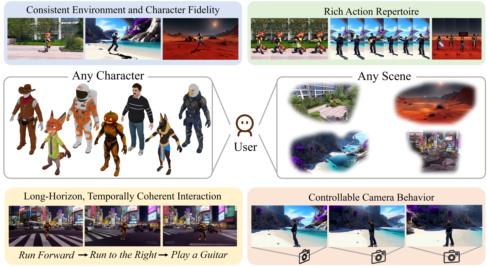

<h1 align="center">
  Animate Any Character in Any World
</h1>

  <strong>Long-horizon world exploration with user-specified characters capable of performing open-ended actions.</strong>

  <a href="https://scholar.google.com/citations?user=qnOwZmkAAAAJ">Yitong Wang</a>1,2*&nbsp;&nbsp;
  <a href="https://www.microsoft.com/en-us/research/people/fawe/">Fangyun Wei</a>2*&nbsp;&nbsp;
  <a href="https://hongyanz.github.io/">Hongyang Zhang</a>3&nbsp;&nbsp;
  <a href="https://datascience.hku.hk/people/bo-dai/">Bo Dai</a>4&dagger;&nbsp;&nbsp;
  <a href="https://www.microsoft.com/en-us/research/people/yanlu/">Yan Lu</a>2

  1<a href="https://www.fudan.edu.cn/en/">Fudan University</a>&nbsp;&nbsp;
  2<a href="https://www.microsoft.com/en-us/research/lab/microsoft-research-asia/">Microsoft Research</a>&nbsp;&nbsp;
  3<a href="https://uwaterloo.ca/">University of Waterloo</a>&nbsp;&nbsp;
  4<a href="https://www.hku.hk/">The University of Hong Kong</a>
   
  <small>*Equal Contribution</small>
  <small>&dagger;Corresponding Author</small>

  
  
  

---

## 📖 Abstract

Recent advances in world models have greatly enhanced interactive environment simulation. Existing methods mainly fall into two categories: (1) static world generation models, which construct 3D environments without active agents, and (2) controllable-entity models, which allow a single entity to perform limited actions in an otherwise uncontrollable environment. 

In this work, we introduce **AniX**, a system enables users to provide 3DGS scene along with a 3D or multi-view character, enabling interactive control of the character's behaviors and active exploration of the environment through natural language commands. The system features: (1) **Consistent Environment and Character Fidelity**, ensuring visual and spatial coherence with the user-provided scene and character; (2) a **Rich Action Repertoire** covering a wide range of behaviors, including locomotion, gestures, and object-centric interactions; (3) **Long-Horizon, Temporally Coherent Interaction**, enabling iterative user interaction while maintaining continuity across generated clips; and (4) **Controllable Camera Behavior**, which explicitly incorporates camera control—analogous to navigating 3DGS views—to produce accurate, user-specified viewpoints.

 

  

---

  <small>© 2025 AniX Project. Licensed under <a href="http://creativecommons.org/licenses/by-sa/4.0/">CC BY-SA 4.0</a>.</small>

