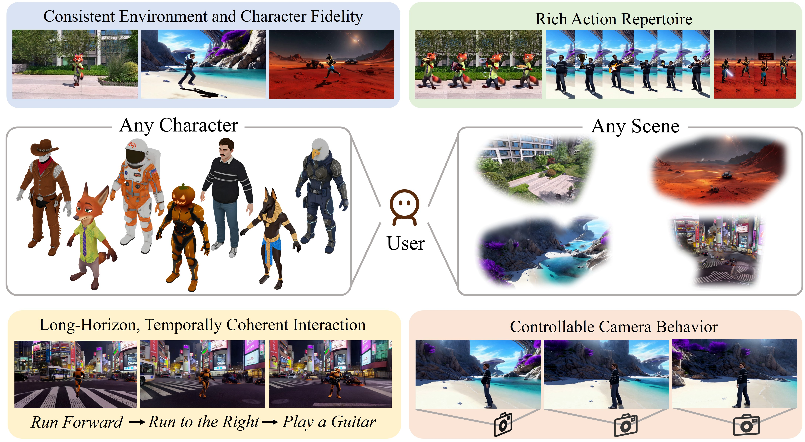

<div align="center">

<h1 align="center">
  CustomX: Unified Character, Action, and Scene Customization in Video World Models
</h1>

<h3 align="center">
  ECCV 2026
</h3>

<p align="center" style="font-size: 1.1em; color: #555;">
  <strong>A framework that leverages user-specified 3D character and scene assets for long-horizon world exploration with various open-ended actions.</strong>
</p>

<div align="center">
  <a href="#">Yitong Wang</a><sup>1,2*</sup>&nbsp;&nbsp;
  <a href="https://www.microsoft.com/en-us/research/people/fawe/">Fangyun Wei</a><sup>2*</sup>&nbsp;&nbsp;
  <a href="https://hongyanz.github.io/">Hongyang Zhang</a><sup>3</sup>&nbsp;&nbsp;
  <a href="https://datascience.hku.hk/people/bo-dai/">Bo Dai</a><sup>4</sup><sup>&dagger;</sup>&nbsp;&nbsp;
  <a href="https://www.microsoft.com/en-us/research/people/yanlu/">Yan Lu</a><sup>2</sup>
</div>

<p align="center" style="font-size: 0.9em; color: #666;">
  <sup>1</sup><a href="https://www.fudan.edu.cn/en/">Fudan University</a>&nbsp;&nbsp;
  <sup>2</sup><a href="https://www.microsoft.com/en-us/research/lab/microsoft-research-asia/">Microsoft Research</a>&nbsp;&nbsp;
  <sup>3</sup><a href="https://uwaterloo.ca/">University of Waterloo</a>&nbsp;&nbsp;
  <sup>4</sup><a href="https://www.hku.hk/">The University of Hong Kong</a>
  <br>
  <small><sup>*</sup>Equal Contribution</small>
  <small><sup>&dagger;</sup>Corresponding Author</small>
</p>

<p align="center">
  <a href="https://arxiv.org/abs/2512.17796"></a>
  <a href="https://snowflakewang.github.io/CustomX_Page/"></a>
  <a href="https://github.com/snowflakewang/CustomX"></a>
  <a href="https://huggingface.co/SnowflakeWang/CustomX"></a>
</p>

</div>

---

## 📖 Abstract

Recent advances in world models have greatly enhanced interactive environment simulation. Existing methods mainly fall into two categories: (1) static world generation models, which construct 3D environments without active agents, and (2) controllable-entity models, which allow a single entity to perform limited actions in an otherwise uncontrollable environment. In this work, we introduce CustomX, leveraging the realism and structural grounding of static world generation while extending controllable-entity models to support user-specified characters capable of performing open-ended actions. Users can provide a 3DGS scene and a character, then use natural language to direct the character to perform diverse behaviors, ranging from basic locomotion to object-centric interactions, while freely exploring the environment. CustomX synthesizes temporally coherent video clips that preserve visual fidelity with the provided scene and character, formulated as a conditional autoregressive video generation problem. Built upon a pre-trained video generator, our training strategy significantly enhances motion dynamics while maintaining generalization across actions and characters. Our evaluation covers a broad range of aspects, including visual quality, character consistency, action controllability, and long-horizon coherence.

<div align="center">
  
</div>

## 🛠️ Installation
```bash
conda create -n customx python==3.11.9
conda activate customx

pip install uv

uv pip install torch==2.4.0 torchvision==0.19.0 torchaudio==2.4.0 --index-url https://download.pytorch.org/whl/cu124
uv pip install -r requirements.txt

wget https://github.com/Dao-AILab/flash-attention/releases/download/v2.6.3/flash_attn-2.6.3+cu123torch2.4cxx11abiFALSE-cp311-cp311-linux_x86_64.whl
uv pip install flash_attn-2.6.3+cu123torch2.4cxx11abiFALSE-cp311-cp311-linux_x86_64.whl
```

## 📦 Download Checkpoints
### HunyuanCustom Base Model
Download HunyuanCustom base model [here](https://huggingface.co/tencent/HunyuanCustom).

Only need to download the following files from HunyuanCustom:
```shell
CustomX
└── models
    └── base
        ├── hunyuancustom_editing_720P
        │   └── mp_rank_00_model_states.pt
        ├── vae_3d
        ├── openai_clip-vit-large-patch14
        └── llava-llama-3-8b-v1_1
```

### CustomX LoRA
```bash
TOKEN=xxx # add your Hugging Face token here

hf download --token $TOKEN \
    SnowflakeWang/CustomX \
    --local-dir models/lora
```

## 🚀 Inference

### Input Preparation
We provide a sample input in the [input](input) directory. To use your own inputs, organize them following the same structure.

```shell
input
├── character_assets
│   └── orangeRobot
│       ├── input_list
│       │   ├── ar_cond.list
│       │   ├── character.list
│       │   ├── output_video.list
│       │   ├── pos_prompt.list
│       │   ├── scene.list
│       │   └── scene_mask.list
│       └── multi_view
│           ├── 000_0001.png
│           ├── 002_0001.png
│           ├── 004_0001.png
│           └── 006_0001.png
└── scene_assets
    └── futureUtopia
        ├── all_frame_mask.mp4
        └── videos
            ├── 0.mp4
            ├── 1.mp4
            └── ...
```

### Multi-GPU Inference (Recommended)
```bash
# 720P video inference
# Tested on 8 NVIDIA A100-80G GPUs
bash inference_multi_gpu.sh
```

### Single-GPU Inference
```bash
# 360P video inference
# Tested on 1 NVIDIA A100-80G GPU
bash inference_single_gpu.sh
```

### Video Merging
```bash
# Merge videos generated by auto-regressive inference
python video_merge.py --input_dir "output/orangeRobot_futureUtopia"
```

## 🔮 Citation

```bibtex
@misc{wang2026customx,
      title={CustomX: Unified Character, Action, and Scene Customization in Video World Models}, 
      author={Yitong Wang and Fangyun Wei and Hongyang Zhang and Bo Dai and Yan Lu},
      year={2026},
      eprint={2512.17796},
      archivePrefix={arXiv},
      primaryClass={cs.CV},
      url={https://arxiv.org/abs/2512.17796}, 
}
```

## 💐 Acknowledgements

- [HunyuanCustom](https://github.com/Tencent-Hunyuan/HunyuanCustom)
- [Diffusers](https://github.com/huggingface/diffusers)
- [Transformers](https://github.com/huggingface/transformers)
- [DeepSpeed](https://github.com/deepspeedai/DeepSpeed)
- [Grand Theft Auto V](https://www.rockstargames.com/gta-v)

## 📄 License

This project is licensed under the [CC BY-SA 4.0 License](http://creativecommons.org/licenses/by-sa/4.0/).